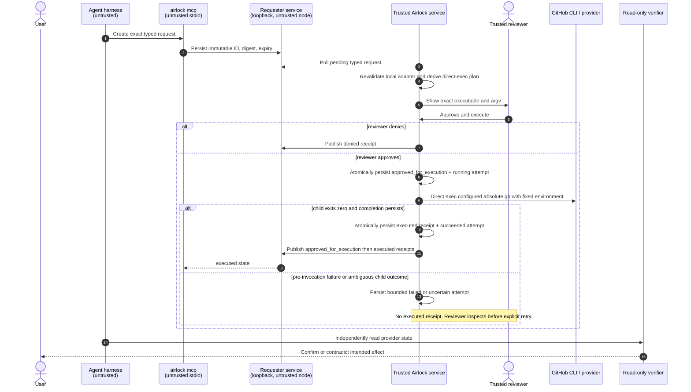

# Airlock approval and trusted-execution timing

The reviewer performs one deliberate action: **Approve and execute**. Airlock
first persists a signed `approved_for_execution` receipt and a bounded local
`running` attempt. Only then does the trusted node directly invoke its locally
reconstructed `gh` argv. This is not a shell or requester action.

Requester/MCP/Hermes surfaces can create and observe requests only. They never
receive an execution endpoint, reusable approval, credential, or executor
detail. `executed` means the trusted child process returned success; ordinary
read-only verification still determines provider state.

## State and receipt meanings

| State/receipt | What it proves | What it does not prove |
|---|---|---|
| `pending` | The requester persisted a typed request. | Review, approval, or execution. |
| `approved_for_execution` | A reviewer authorized a persisted attempt. | Provider invocation or effect. |
| `running` / `failed` / `uncertain` | Trusted-local bounded attempt status. | Provider success or failure details. |
| `executed` | The trusted direct child returned success and completion receipt persisted. | GitHub accepted or retains the intended effect. |
| v1 `approved` / `manually_executed` | Historical manual workflow evidence. | New trusted-execution semantics or provider truth. |

## Failure and retry behavior

- Persistence is before effect; a failed approval/reservation write does not
  invoke `gh`.
- The store mutex is released before child execution. Concurrent or replayed
  POSTs find `running` and cannot create another provider call.
- No stdout, stderr, environment, provider body, credential, or free-form
  command is persisted or rendered. Attempt failures use a small enumerated
  code only.
- A restart changes `running` to `uncertain` with an `interrupted` attempt code;
  it never resumes a child. A missing executable or failed process start is the
  only `failed` outcome. Timeout, cancellation, generic non-zero exit, and an
  interrupted child are `uncertain` because GitHub may have accepted the PUT.
  Reviewers may explicitly retry `failed` or `uncertain` attempts after the
  required external verification. GitHub documents `201` for a new invitation
  and `204` for existing access, not a duplicate-invitation retry guarantee.
- If a child may have succeeded but terminal persistence failed, Airlock records
  uncertainty (or restart recovery does) and never emits `executed`. Verify
  provider state before an explicit retry.
