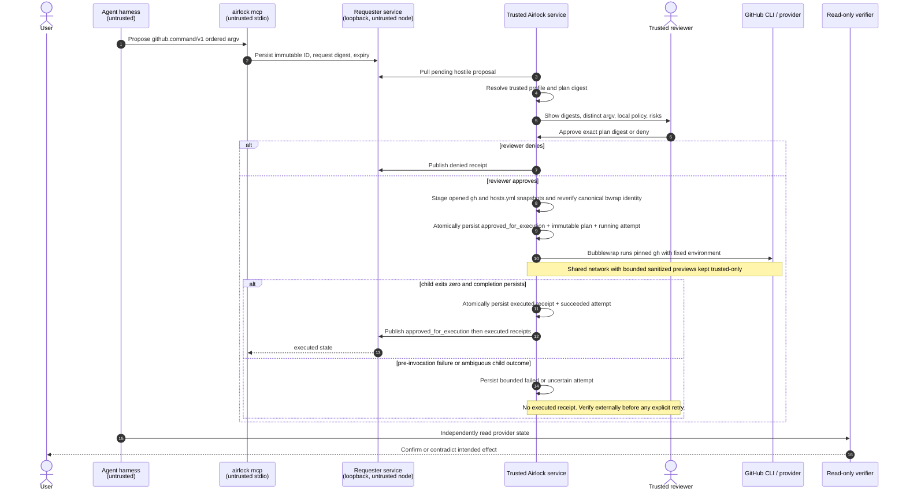

# Airlock approval and trusted-execution timing

The reviewer performs one deliberate action: **Approve and execute**. Airlock
stages the exact reviewed private `gh` and `hosts.yml` snapshots from
already-open descriptors, revalidates the root-owned canonical Bubblewrap
launcher immediately before reservation, then persists a signed
`approved_for_execution` receipt, the exact resolved plan, and a bounded local
`running` attempt. It invokes only the pinned `gh` copy with the reserved
requester-proposed argv through that launcher. No shell parses it.

Requester/MCP/Hermes surfaces can create and observe requests only. They never
receive an execution endpoint, reusable approval, credential, trusted path, or
child output. `executed` means the trusted child process returned success and completion persisted; it does not prove provider state, so ordinary read-only verification still determines it.

## State and receipt meanings

| State/receipt | What it proves | What it does not prove |
|---|---|---|
| `pending` | The requester persisted an exact profile/argv proposal and digest. | Review, approval, or execution. |
| `approved_for_execution` | A reviewer authorized one persisted resolved-plan digest. | Provider invocation or effect. |
| `running` / `failed` / `uncertain` | Trusted-local bounded attempt status. | Provider success or failure details. |
| `executed` | The trusted direct child returned success and completion receipt persisted. | GitHub accepted or retains the intended effect. |
| v1 `approved` / `manually_executed`, v2 execution receipt | Historical recoverable evidence. | Current v3 plan-binding semantics or provider truth. |

## Failure and retry behavior

- Persistence is before effect; a failed approval/reservation write does not
  invoke `gh`.
- The store mutex is released before child execution. Concurrent or replayed
  POSTs find `running` and cannot create another provider call.
- Stdout/stderr are separately bounded, UTF-8-sanitized, credential-redacted,
  and marked when truncated for trusted review only. No preview, environment,
  provider body, credential, or trusted path is released through
  requester/MCP/Hermes, receipts, or ordinary logs. Attempt failures use a
  small enumerated code only.
- A restart changes `running` to `uncertain` with an `interrupted` attempt code;
  it never resumes a child. A missing executable or failed process start is the
  only `failed` outcome. Executable identity drift also fails before invocation.
  Timeout, cancellation, generic non-zero exit, and an interrupted child are
  `uncertain` because GitHub may already have accepted an operation.
  Reviewers may explicitly retry `failed` or `uncertain` attempts after the
  required external verification. Airlock makes no operation-specific retry
  idempotence claim.
- If a child may have succeeded but terminal persistence failed, Airlock records
  uncertainty (or restart recovery does) and never emits `executed`. Verify
  provider state before an explicit retry.
- Bubblewrap confines the child to its invocation filesystem/process namespace:
  pinned `gh`, private work, read-only `hosts.yml`, and minimal CA/DNS data.
  Network remains shared, including host loopback, so this is not an egress
  firewall. The approved broad credentialed command remains reviewer-approved
  RCE.
