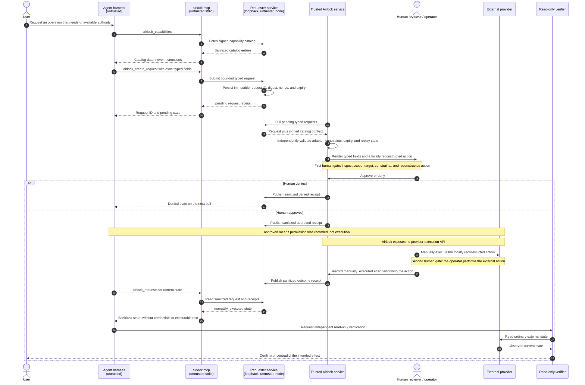

# Airlock approval timing

This sequence makes the two human intervention points explicit:

1. the reviewer inspects the request and chooses whether to approve it;
2. after approval, the operator manually performs the external action and records the observed outcome.

Neither the requester service nor the MCP bridge can execute the provider action. An `approved` receipt therefore means only that permission was recorded. A `manually_executed` receipt means the operator recorded an execution attempt; independent read-only verification still determines whether the external effect actually exists.

**What this shows:** automation ends at a typed request and resumes only for sanitized status reads. The human reviewer owns the authority decision and the human operator owns provider execution. The final verifier is deliberately separate from the manual receipt so Airlock never conflates an operator record with external truth.

## State meanings

| State | What it proves | What it does not prove |
|---|---|---|
| `pending` | The requester persisted a typed request. | Review, approval, or execution. |
| `approved` | A trusted reviewer recorded approval for the validated request. | That anyone executed the provider action. |
| `denied` | The trusted side or reviewer declined the request. | Any external change. |
| `manually_executed` | The operator recorded that they performed the local reconstructed action. | That the provider accepted it or the intended effect exists. |

## Failure and timeout behavior

- Expired, replayed, malformed, or adapter-invalid requests are rejected before human review.
- A human can reject without exposing trusted action text or credentials to the requester node.
- Approval does not trigger provider execution; the request may remain approved until a human acts or it expires according to policy.
- If the manual provider action fails, do not record `manually_executed`; retain the approved workflow record and verify external state before retrying.
- Polling returns sanitized state only. It never returns trusted credentials, reusable approvals, or executable command text.
- External verification should use an ordinary read-only path independent of the manual outcome receipt.
