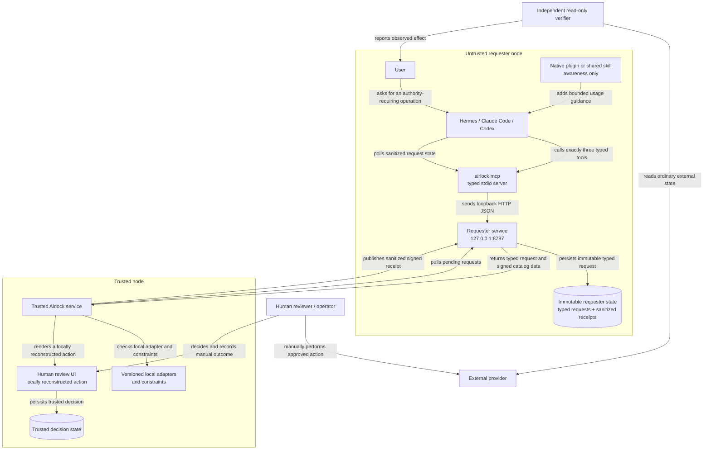
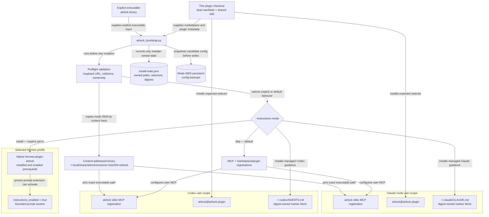
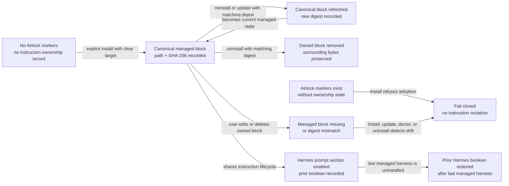

# Airlock architecture diagrams

These diagrams describe the cross-harness package in this repository and the wider Airlock system it connects to. The package remains on the untrusted requester node: it provides awareness and typed tools, not credentials, approval, or execution authority.

The dedicated approval timeline is in [`approval-timing.md`](approval-timing.md). Raw Mermaid sources live in [`diagrams/`](diagrams/) and are kept byte-for-byte aligned with the fenced diagrams below.

## Trust boundary and runtime topology

**What this shows:** credentials and executable provider actions stay outside the untrusted node. The requester stores typed requests and sanitized receipts; the trusted service revalidates them against local adapters, and a human performs the external action. Even the final receipt is followed by an independent read-only verification path.

## Installation and ownership topology

**What this shows:** the bootstrapper never discovers or builds an arbitrary executable. It copies one explicit binary by hash, pins both MCP registrations to that immutable path, treats awareness instructions as a separate opt-in, and records enough ownership state to refuse unsafe updates or removals.

## Managed instruction lifecycle

**What this shows:** marker comments alone are not ownership. The installer also records the target path and content digest. A matching record permits idempotent refresh or precise removal; missing state, changed content, failed Hermes reads, and malformed targets fail before mutation.

## Non-goals visible in the diagrams

- No generic shell runner or requester-supplied command execution.
- No trusted credentials, approval tokens, or provider execution URLs cross to the requester node.
- No hook automatically converts another tool failure into an Airlock request.
- `approved` is not execution, and `manually_executed` is not independent proof of the external effect.
- The cross-harness package does not install the native Hermes plugin; it verifies that prerequisite before enabling its prompt section.
